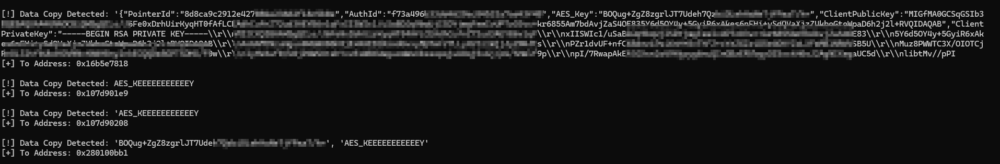

# iOS Frida Hook: memcpy

A Frida script to monitor memory operations on iOS. This tool intercepts the `memcpy` function within `libsystem_c.dylib` to capture sensitive data—such as API keys, secrets, or request payloads—as they are moved within the application's memory.

`memcpy` is one of the most frequently called functions in any C-based environment. By hooking it, you gain a window into how the application handles data internally before it is encrypted or after it is decrypted.


### How it Works
The script hooks the following signature:
`void *memcpy(void *dest, const void *src, size_t n);`

* **args[0] (`dest`):** The destination memory address.
* **args[1] (`src`):** The source memory address.
* **args[2] (`n`):** The number of bytes to be copied.

---

## 🚀 Usage

1. **Prerequisites:** A jailbroken iOS device with `frida-server` running.
2. **Setup:** Save the script below as `hook_memcpy.js`.
3. **Recommendation**: Sometime frida will only work if the application is already running.
4. **Execution:**
   ```bash
   frida -U <Application_Bundle> -l hook_memcpy.js

   
In this example I made the script to filter the word **AES** from the **memcpy**

