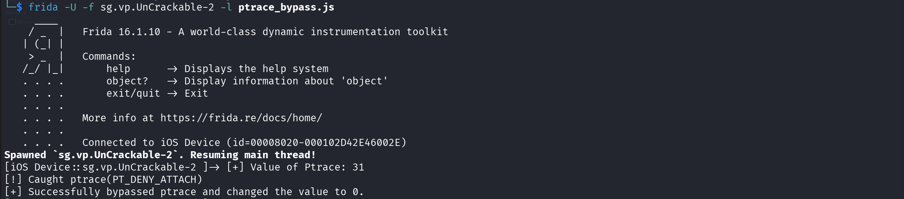
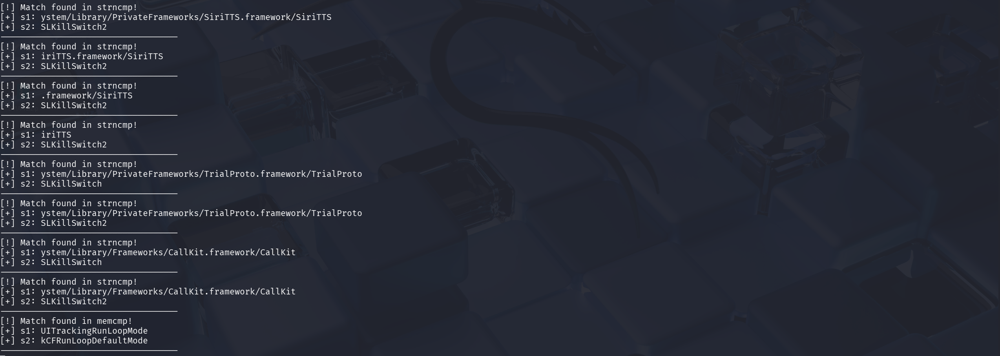
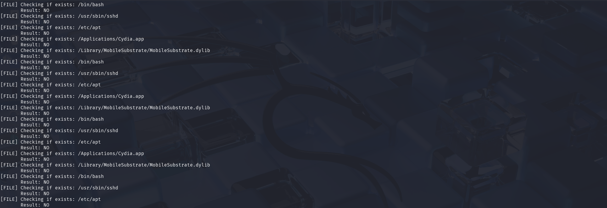

# iOS Frida Scripts

A collection of Frida scripts designed to streamline iOS application security and debugging.


### About the scripts

You will find scripts:

- **Ptrace Bypass**: Disable anti-debugging protections to keep your session alive.
- **Hooking comparison functions**: Intercept and log string/data comparison functions.
- **Hooking fileExistsAtPath from NSFileManager**: Monitor file system activity by intercepting fileExistsAtPath
- **Memory Dumping**: Extract sensitive data from memory by hooking memcpy

---

## 🚀 Recommendation
I am using Frida version 16.1.10, which was compatible with me to use with my jailbroken device

Frida version 17+ might not work, cause in the newer version of it, they changed the module API functions, such `findExportByName`, which used to hook C functions.
You can check it here [Frida 17](https://frida.re/news/2025/05/17/frida-17-0-0-released/)


## Ptrace Bypass

iOS binaries often use the **ptrace** system call with the *PT_DENY_ATTACH* flag to detect if a debugger is present. If the function detects a debugging tool, it will immediately terminate the application to prevent analysis.
This script hooks the ptrace implementation and patches it to prevent the application from exiting

```javascript
const ptracePtr = Module.findExportByName(null, "ptrace");

if (ptracePtr) {
    Interceptor.attach(ptracePtr, {
        onEnter: function (args) {
            const request = args[0].toInt32();
            console.log('[+] Value of Ptrace: ' + request)
            if (request === 0x1f) {
                console.log("[!] Caught ptrace(PT_DENY_ATTACH)");
                this.isPTraceDeny = true;
            }
        },
        onLeave: function (retval) {
            if (this.isPTraceDeny) {
                retval.replace(ptr("0x0"));
                console.log("[+] Successfully bypassed ptrace and changed the value to 0.");
            }
        }
    });
}

```


## Hooking Comparison Functions

Comparison functions like **strcmp**, **strncmp**, and **memcmp** are frequently used in iOS applications to validate passwords, license keys, or API tokens. By hooking these, you can observe both the user-supplied input and the "expected" value stored in memory.

```javascript

const cmps = [
    "strcmp",
    "strncmp",
    "strcasecmp",
    "strncasecmp",
    "memcmp",
    "strcoll"
];

cmps.forEach(funcName => {
    const funcPtr = Module.findExportByName("libsystem_c.dylib", funcName);

    if (funcPtr) {
        Interceptor.attach(funcPtr, {
            onEnter: function (args) {
                try {
                    const s1 = Memory.readUtf8String(args[0]);

                    // add s1.includes("<whatever you want>") to get what you are comapring to
                    if (s1) {
                        const s2 = Memory.readUtf8String(args[1]);

                        console.log(`[!] Match found in ${funcName}!`);
                        console.log(`[+] s1: ${s1}`);
                        console.log(`[+] s2: ${s2}`);
                        console.log(`-----------------------------------`);
                    }
                } catch (e) {

                }
            }
        });
    }
});

```


## Hooking fileExistsAtPath from NSFileManager

The **fileExistsAtPath:** method is a common target for Jailbreak Detection bypasses. Many iOS apps use this to check for the presence of files like `/Applications/Cydia.app`, `/bin/bash`, or `/usr/sbin/sshd`.

By hooking this method, you can see exactly which files the app is searching for and spoof the result to make the app believe the device is not jailbroken.

```javascript

if (ObjC.available) {
    ObjC.schedule(ObjC.mainQueue, function () {

        const NSFileManager = ObjC.classes.NSFileManager;
        const fileExists = NSFileManager["- fileExistsAtPath:"];
        Interceptor.attach(fileExists.implementation, {
            onEnter: function (args) {
                // args[0] = self, args[1] = selector, args[2] = path
                this.path = new ObjC.Object(args[2]).toString();
                console.log("[FILE] Checking if exists: " + this.path);
            },
            onLeave: function (retval) {
                // Returns a BOOL (0 or 1)
                console.log("       Result: " + (retval.toInt32() ? "YES" : "NO"));
            }
        });
    });
}

```



## Memory Dumping

Hooking the memcpy function is a powerful technique for extracting sensitive data. Since memcpy is responsible for moving data from one memory location to another, it is frequently used to handle decrypted strings, API keys, or session tokens after they have been processed in memory.
This script intercepts memcpy calls and provides a hex dump of the source data, allowing you to see what information is being transferred in real-time.

```javascript
const memcpy = Module.findExportByName("libsystem_c.dylib", "memcpy");

Interceptor.attach(memcpy, {
    onEnter: function (args) {
        this.dest = args[0];
        this.src = args[1];
        this.size = args[2].toInt32();

        if (this.size > 4) {
            try {
                const content = this.src.readUtf8String(this.size);
                if (content.includes("key")) { // change "key" to any other string to detect it
                    console.log("\n[!] Data Copy Detected: " + content);
                    console.log("[+] To Address: " + this.dest);
                }
            } catch (e) {

            }
        }
    }
});

```

   
In this example, I made the script to filter the word **AES** from the **memcpy**

